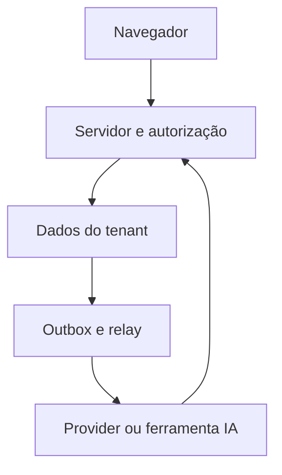

# Threat model inicial — BipeSend

Data: 2026-09-13. Responsáveis: engenharia de plataforma para identidade/dados; equipe de produto para decisões de UX; operação para chaves/backups/infra; revisão de segurança para aceite final. Papéis funcionais, ainda sem nomes de responsáveis operacionais atribuídos.

## Ativos e fronteiras

Ativos: identidade/sessão, tenant e permissões, contatos/conversas/documentos, embeddings, integrações e credenciais, cobranças, auditoria, backups. Atores: visitante, membro tenant, admin tenant, platform owner, worker, provider e agente IA. Fronteiras: navegador↔Next; Next/API↔dados; transação↔fila; provider↔webhook; documento/LLM↔tool; operação↔secret manager.

O diagrama representa a direção dos efeitos; não implica que todos os adapters/relays já existam.

## Ameaças e critérios

| Risco | Controle exigido | Situação desta branch | Gate/responsável |
| --- | --- | --- | --- |
| Seleção de tenant alheio/IDOR | sessão + membership atual + recurso + RLS | policies e middleware preparados; DB não validado | AUTH-001/008 · plataforma |
| Bypass RLS por role privilegiada | runtime mínimo, FORCE, WITH CHECK e vínculos indiretos | divergências no histórico; bloqueio | AUTH-001 · dados |
| Contexto vaza entre conexões | SET LOCAL e query no mesmo tx | helper/adapter testado sem PG real | AUTH-001 · dados |
| Cookie forjado abre painel | guard de sessão no servidor | implementado, teste de navegador | AUTH-009 · plataforma |
| Sessão copiada/revogada | registro de sessão, revogação por dispositivo, TTL/idle | revisão updatedAt; logout só cookie ainda insuficiente | AUTH-004/016 · plataforma |
| Cookie/credencial de plataforma no tenant | cookies/secrets/classes separados + MFA | separação e callbacks; enrollment incompleto | AUTH-014 · plataforma |
| Reset por força bruta/replay | CSPRNG, HMAC, expiração, limiter e transação | runtime novo + unidade; concorrência DB pendente | AUTH-005 · plataforma |
| Reset legado contorna proteção | uma entrada canônica | endpoints Fastify antigos retornam 410 | AUTH-004/015 · plataforma |
| Enumeração/timing de e-mail | resposta neutra e envio assíncrono limitado | mensagem uniforme; timing/PII ainda parcial | AUTH-003/005 · plataforma |
| Brute force/custo distribuído | limite identidade + IP/global + orçamento | Redis por identidade; edge/global pendente | INF-006/AUTH-015 · operação |
| CSRF/Host spoofing | SameSite, proteção do framework, origin/proxy confiável | contratos e cookies; ambiente precisa E2E | AUTH-016/INF-006 · plataforma |
| Escalada por convite/role | subconjunto de permissões e lock no tx | policies/serviço corrigidos; capability RLS pendente | AUTH-007/008 · plataforma |
| Uso indevido do bootstrap | nonce controlado, stdin sem eco, lock, auditoria, MFA | stdin/nonce/lock corrigidos; auditoria/enrollment abertos | AUTH-013 · operação |
| Vazamento de credencial armazenada | AEAD/keyId/AAD, rotação e segredo fora de log | primitive pronta; migração TOTP/OAuth pendente | AUTH-014/15 · plataforma |
| Webhook falso/duplicado | raw bytes, algoritmo provider, janela e dedupe | genérico preparado; provider/dedupe pendentes | AUTH-015/MSG-005 · integrações |
| Evento fantasma/perdido | outbox no commit e relay idempotente | helper sem storage/worker | MSG-001/002 · dados |
| Upload/SSRF/arquivo hostil | quarentena, MIME real, tamanho, scan, allowlist | UI apenas seleção; backend futuro | AI-001 · dados |
| Injeção em RAG/tool | dados não dão autoridade; tenant/ACL/tool allowlist | regra e plano, sem runtime IA | AI-003/006/007 · IA |
| Cobrança/envio não autorizado | entitlement, idempotência, confirmação e auditoria | roadmap, sem provider real | BILL/MSG · plataforma |
| Log/cache/backup vira vazamento | minimização, escopo, retenção e acesso mínimo | helper/header redaction; operação pendente | TEAM-004/OPS-001/002 |

## Aceite e revisão

Não liberar produção com P0 de migração, RLS ou sessão em aberto. O nível de revisão deve seguir controles verificáveis de ASVS, sem tratar o arquivo como certificação. Testes devem registrar o motivo da negação: banco desconectado não comprova autorização correta.

Revisar este modelo ao adicionar provider, tool, nova superfície, forma de autenticação, armazenamento local/mobile ou mudança de permissão. Dados reais não são necessários para testes negativos: usar dois tenants sintéticos, papéis diferentes e chaves de teste descartáveis.
